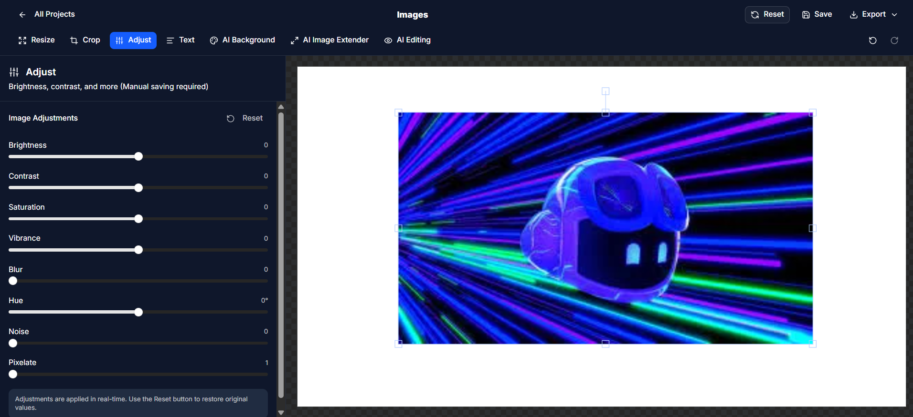
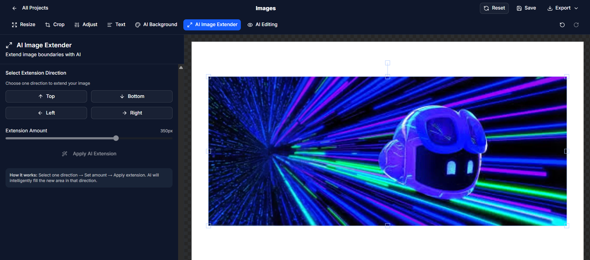

# रूपPix

**AI-powered photo editing that just works.**


RupPix is a photo editor built for anyone who needs professional results without the learning curve. Named after the Hindi word "रूप" (rup), meaning beauty or form, it brings together traditional editing tools with AI features that actually make sense.

## What you can do

**Basic editing** - Adjust colors, crop to any size, resize without losing quality. The essentials, done right.

**AI Background** - Remove backgrounds or swap them out entirely. Works on portraits, products, anything really.

**AI Extend** - Need more space in your photo? The AI fills in the edges naturally, matching your image's style.

**Upscale** - Make images bigger without the blur. Goes up to 4x the original size using neural networks.

Plus filters, adjustments, and other tools you'd expect from a proper photo editor.


## Why use it
It's fast. The heavy lifting happens on our side, so most edits are instant. Even the AI features only take a few seconds.

## Getting it running

You'll need Node.js 18 or newer installed.

```bash
git clone https://github.com/yourusername/ruppix.git
cd ruppix
npm install
npm run dev
```

Open your browser to the URL it shows (usually localhost:5173). That's it.

## The interface



Everything's where you'd expect it. Tools on the left, your image in the center, adjustments on the right. No hidden menus or mystery icons.

Upload an image by dragging it in or clicking the upload area. Pick a tool, make your edits, export when you're done. Supports JPEG, PNG, WebP, and HEIC files.

## AI features explained

**Extend** - Click the edges you want to expand. The AI generates new content that blends with your image. Good for fixing composition or creating wider crops.


*Extending an image to the sides - the AI matches the scene*

**Background** - One click removes the background. Or choose from preset backgrounds, upload your own, or just leave it transparent.

**Upscale** - Select 2x or 4x and let it run. The AI adds detail instead of just stretching pixels. Best for images you need to print or use at larger sizes.


## Technical details

Built with React and Nejsxt. AI models run through ImageKit. Image processing uses FabricJs. Styled with Tailwind CSS and ShadCn UI

Works in Chrome, Firefox, Safari, and Edge. Mobile browsers dont support editing

## Disclaimer
Since we’re using the ImageKit API for AI features, it’s possible that the usage limit has been reached.
## Contributing

Found a bug? Have an idea? Open an issue or submit a pull request


## License

MIT License - use it however you want.

